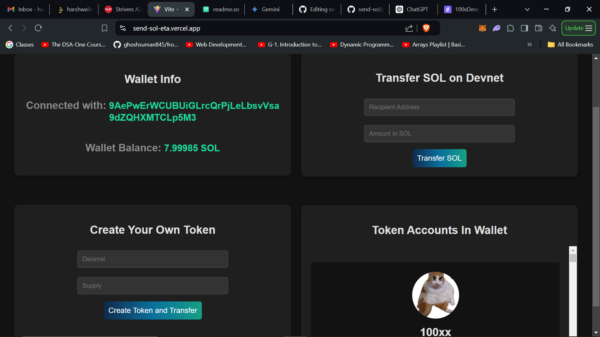
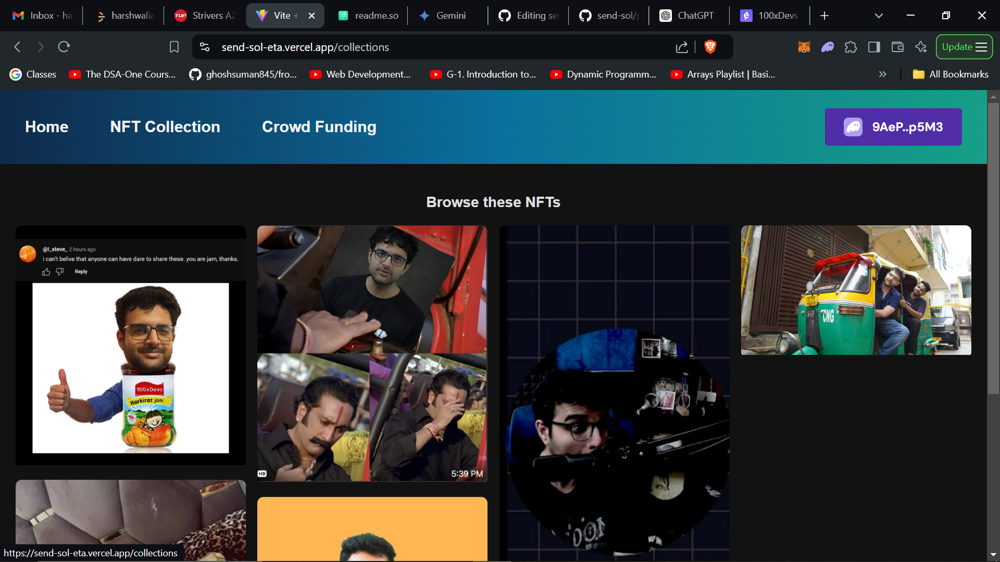
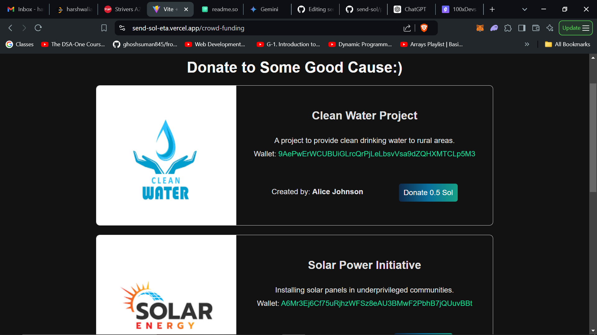

# Send-Sol

**Send-Sol** is a Solana-based web application that provides a seamless way to interact with your Solana wallet. The project is designed for quick and easy wallet integration, showcasing wallet information, performing transactions, and managing tokens. It includes essential functionalities to enhance user interaction with the Solana blockchain, making it a great fit for those looking to explore Solana's ecosystem.



## Features

- **Connect Solana Wallet**: Easily connect your Solana wallet and view wallet information.
  
- **Transfer SOL on Devnet**: Supports transferring SOL tokens within the Solana Devnet environment.

- **Create Your Own Token**: Allows users to create and manage their own custom tokens.

- **Display Token Accounts**: Shows all the token accounts in your wallet, including both normal and SPL tokens with associated metadata.

- **Mint NFTs**: Users can mint NFTs directly through the application.

- **Crowdfunding Donation**: Provides an option to donate SOL tokens to crowdfunding projects.

## Getting Started

### Prerequisites

- Install [Node.js](https://nodejs.org/)
- Have a Solana wallet (such as [Phantom](https://phantom.app/)) installed and configured

### Installation

1. Clone the repository:

   ```bash
   git clone https://github.com/waliaharsh74/send-sol.git
2. Navigate to the project directory:

   ```bash
   cd send-sol
3. Install dependencies && Start the development server::

   ```bash
   npm install
   npm run dev
4. Open your browser and go to http://localhost:5173 to view the application.


## Usage

1. **Connect Wallet**: Click on the "Connect Wallet" button to link your Solana wallet.
2. **View Wallet Information**: After connecting, your wallet address and balance will be displayed.
3. **Transfer SOL**: Use the transfer feature to send SOL tokens to other addresses on the Devnet.
4. **Create and Manage Tokens**: Create your own token and view the list of tokens in your wallet.
5. **Mint NFTs**: Click on the "Mint NFT" option to create new NFTs.
6. **Donate**: Use the donate feature to contribute to a selected crowdfunding project.



## Notes

- Showing NFTs on the website may take up to 1 minute due to the server being idle. Please be patient while the NFTs are loaded.

## Contributing

Contributions are welcome! Please feel free to submit a pull request or open an issue for any bugs or feature requests.


   


